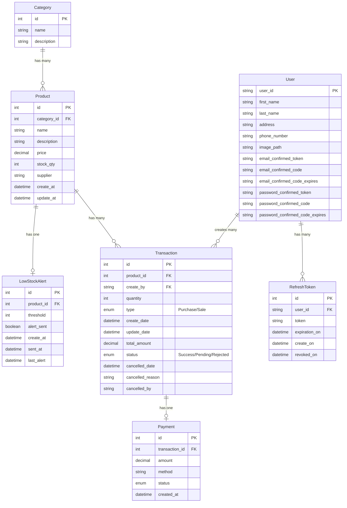

# Inventory Management System API

A robust RESTful API built with ASP.NET Core 8 for comprehensive inventory management, featuring clean architecture, advanced security, and automated workflows.

## 🚀 Features

### Core Inventory Management
- **Product Management**: Complete CRUD operations for products with detailed specifications
- **Category Management**: Hierarchical category organization and management
- **Transaction Tracking**: Real-time inventory transactions with audit trails
- **Low-Stock Alerts**: Automated notifications when inventory levels drop below thresholds

### Security & Authentication
- **JWT Authentication**: Secure token-based authentication system
- **Role-Based Access Control (RBAC)**: Granular permissions for different user roles
- **ASP.NET Identity Integration**: Comprehensive user management

### Automated Workflows
- **User Registration**: Automated account creation with email verification
- **Password Reset**: Secure password recovery via email
- **System Alerts**: Real-time notifications for critical inventory events
- **SMTP Email Services**: Reliable email delivery for all automated communications

## 🏗️ Architecture

This project follows **Clean Architecture** principles with **CQRS** pattern implementation:

```
├── API Layer (Controllers, Middleware)
├── Application Layer (Commands, Queries, Handlers)
├── Domain Layer (Entities, Exceptions, Repositories, Specifications, Value Objects)
└── Infrastructure Layer (Data Access, Migrations, External Services)
```

### Key Architectural Patterns
- **Clean Architecture**: Separation of concerns with dependency inversion
- **CQRS (Command Query Responsibility Segregation)**: Separate models for read and write operations
- **MediatR**: In-process messaging for decoupled communication
- **Repository Pattern**: Abstracted data access layer

## 🗄️ Database Schema

The system uses Microsoft SQL Server with the following core entities and relationships:



### Entity Relationships

- **Category → Product**: One-to-Many (A category can have multiple products)
- **Product → Transaction**: One-to-Many (A product can have multiple transactions)
- **Product → LowStockAlert**: One-to-One (Each product can have one active alert)
- **Transaction → Payment**: One-to-One (Each transaction can have one payment record)
- **User → Transaction**: One-to-Many (A user can create multiple transactions)
- **User → RefreshToken**: One-to-Many (A user can have multiple refresh tokens)

## 🛠️ Tech Stack

- **Framework**: ASP.NET Core 8
- **Language**: C#
- **Architecture**: Clean Architecture, CQRS
- **ORM**: Entity Framework Core
- **Database**: Microsoft SQL Server
- **Authentication**: ASP.NET Identity + JWT
- **Validation**: Fluent Validation
- **Mapping**: AutoMapper
- **Logging**: Serilog
- **Messaging**: MediatR
- **Email**: SMTP Email Services

## 📋 Prerequisites

- .NET 8 SDK
- Microsoft SQL Server (LocalDB or full instance)
- Visual Studio 2022 or VS Code
- Git

## 🚀 Getting Started

### 1. Clone the Repository
```bash
git clone https://github.com/yourusername/inventory-management-api.git
cd inventory-management-api
```

### 2. Configure Database Connection
Update the connection string in `appsettings.json`:
```json
{
  "ConnectionStrings": {
    "DefaultConnection": "Server=(localdb)\\mssqllocaldb;Database=InventoryManagementDB;Trusted_Connection=true;MultipleActiveResultSets=true"
  }
}
```
### 3. Configure JWT Settings
Add the JWT configuration in `appsettings.json`:
```json
{
  "JwtOptions": {
    "SecretKey": "your-secret-key",
    "Issuer": "InventoryAPI",
    "Audience": "InventoryClients",
    "ExpirationInMinutes": 60
  }
}
```

### 4. Email Settings
Add SMTP configuration in `appsettings.json`:
```json
{
  "EmailSettings": {
    "Host": "smtp.gmail.com",
    "Port": 587,
    "Email": "your-email@gmail.com",
    "Password": "your-app-password",
    "DisplayName": "Abdalrhman Gamal"
  }
}
```

### 5. Apply Database Migrations
```bash
dotnet ef database update
```

### 6. Run the Application
```bash
dotnet run
```

The API will be available at `https://localhost:7036` or `http://localhost:5086`.

## 📚 API Documentation

Once the application is running, access the interactive API documentation:
- **Swagger UI**: `https://localhost:7036/swagger`

### Main Endpoints

#### Authentication
- `POST /api/auth/register` - User registration with email confirmation
- `POST /api/auth/login` - User login with JWT token response
- `GET /api/auth/email-confirmation` - Confirm email with verification code
- `GET /api/auth/resend-confirmation` - Resend confirmation email
- `POST /api/auth/forget-password` - Initiate password reset
- `POST /api/auth/reset-password` - Complete password reset
- `GET /api/auth/refreshToken` - Refresh JWT token
- `POST /api/auth/revokeToken` - Revoke refresh token

#### Account Management
- `GET /api/account` - Get current user profile
- `PUT /api/account` - Update user profile
- `PATCH /api/account/change-password` - Change user password
- `DELETE /api/account` - Delete user account
- `POST /api/account/image` - Upload profile image
- `DELETE /api/account/image` - Delete profile image

#### Admin User Management
- `GET /api/account/admin/users` - Get all users (paginated, sortable)
- `POST /api/account/admin/role` - Add user to role
- `DELETE /api/account/admin/role` - Remove user from role

#### Products
- `GET /api/products` - Get all products (paginated, sortable, filterable)
- `POST /api/products` - Create new product
- `GET /api/products/{id}` - Get product by ID
- `PUT /api/products/{id}` - Update product
- `DELETE /api/products/{id}` - Delete product

#### Categories
- `GET /api/categories` - Get all categories (paginated)
- `POST /api/categories` - Create new category
- `PUT /api/categories/{id}` - Update category
- `DELETE /api/categories/{id}` - Delete category

#### Inventory Transactions
- `GET /api/transactions` - Get transaction history (paginated, sortable, date filterable)
- `POST /api/transactions` - Create new transaction (Purchase/Sale)
- `GET /api/transactions/{id}` - Get transaction by ID
- `PUT /api/transactions/{id}` - Update transaction
- `DELETE /api/transactions/cancel/{id}` - Cancel transaction with reason

#### Low Stock Alerts
- `POST /api/lowstockalerts` - Create low stock alert for product
- `GET /api/lowstockalerts/{id}` - Get low stock alert by ID
- `GET /api/lowstockalerts/product/{productId}` - Get alert by product ID
- `PUT /api/lowstockalerts/{id}` - Update alert threshold

## 📊 Sample API Responses

### Authentication Response
```json
{
  "email": "admin@gmail.com",
  "userName": "admin",
  "roles": ["Admin"],
  "accessToken": "eyJhbGciOiJIUzI1NiIsInR5cCI6IkpXVCJ9...",
  "tokenExpiration": "2025-07-27T19:50:03Z",
  "refreshToken": "4H%O60FYYbp1AiJL51Wc2wHljgD9v4uoyKBSLsRfO14=",
  "refreshTokenExpiration": "2025-08-03T21:48:53.6963819+03:00"
}
```

### Product Response
```json
{
  "id": 1,
  "name": "Dell Laptop",
  "description": "High-performance laptop",
  "category": "Electronics",
  "price": 1100.00,
  "stockQuantity": 7,
  "supplier": "Tech Supplier Inc",
  "createdAt": "2025-08-10T11:42:41.1491153",
  "updatedAt": null
}
```

### Transaction Response
```json
{
  "id": 4,
  "productId": 4,
  "productName": "Dell Laptop",
  "createdBy": "John Doe",
  "status": "Success",
  "createdDate": "2025-08-10T11:45:44.9577731",
  "updatedDate": "2025-08-10T11:47:09.3101133",
  "transactionType": "Sale",
  "quantity": 3,
  "totalAmount": 3300.00
}
```

### Low Stock Alert Response
```json
{
  "id": 2,
  "productId": 4,
  "productName": "Dell Laptop",
  "currentStock": 1,
  "threshold": 3,
  "alertSent": true,
  "createdAt": "2025-08-14T08:28:02.6090022",
  "sentAt": "2025-08-14T13:48:41.679634",
  "lastAlertSent": "2025-08-14T13:48:41.679634"
}
```

## 🔐 Security

The API uses JWT (JSON Web Tokens) for authentication. Include the token in the Authorization header:

```
Authorization: Bearer <your-jwt-token>
```

### User Roles
- **Admin**: Full system access
- **Manager**: Inventory management and reporting
- **User**: Limited read access and basic operations

## 🔍 Advanced Features

### Pagination & Sorting
All list endpoints support pagination and sorting:
```
GET /api/products?PageSize=10&PageNumber=1&SortBy=price&SortDirection=Ascending
GET /api/transactions?startDate=2025-08-01&endDate=2025-08-31&TransactionType=Purchase
```

### Transaction Management
- **Transaction Types**: Purchase (stock increase) and Sale (stock decrease)
- **Status Tracking**: Success, Pending, Rejected with full audit trail
- **Cancellation**: Soft delete with reason tracking for audit compliance

## 📝 Logging

The application uses Serilog for structured logging. Logs are written to:
- Console
- File: `Logs/log-.txt`
